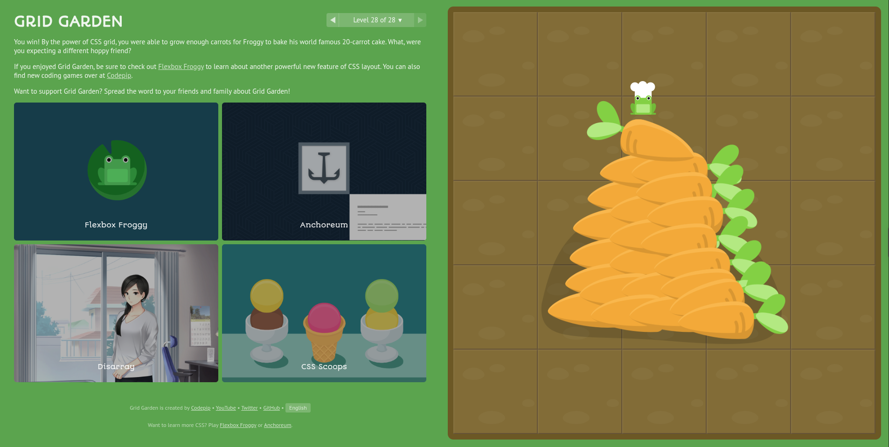
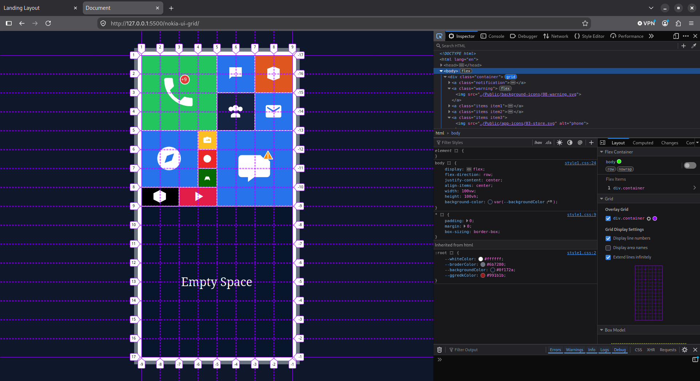

# Zero to CSS 🚀

Welcome to **Zero to CSS** — a personal, hands-on learning journey from absolute beginner to mastering modern CSS layouts. 

The core philosophy of this repository is **learning by building**: mastering core CSS mechanisms through interactive challenges, mathematical understanding of layout engines, and translating real-world user interfaces into clean, framework-free code.

---

## Understanding the Engine: How `fr` Units Work

A foundational concept mastered early on is how CSS Grid distributes available space among **fraction units (`fr`)**.

Given a container with a fixed or available width of **900px** and a track definition of `grid-template-columns: 1fr 2fr 1fr`:

1. **Calculate the sum of all fraction units:**
   $$\sum \text{fr} = 1\text{fr} + 2\text{fr} + 1\text{fr} = 4\text{fr}$$

2. **Determine the pixel value of a single fraction unit ($1\text{fr}$):**
   $$\text{Value of } 1\text{fr} = \frac{\text{Total Available Space}}{\text{Sum of fr}} = \frac{900\text{px}}{4} = 225\text{px}$$

3. **Compute each track width:**
   - **Track 1 (`1fr`):** $1 \times 225\text{px} = 225\text{px}$
   - **Track 2 (`2fr`):** $2 \times 225\text{px} = 450\text{px}$
   - **Track 3 (`1fr`):** $1 \times 225\text{px} = 225\text{px}$

4. **Total Verification:**
   $$225\text{px} + 450\text{px} + 225\text{px} = 900\text{px}$$

---

## Showcase & Projects

### 1. CSS Grid Garden (Foundations Completed — 28/28 Levels) 🥕
The journey started with completing all **28 levels** of [Grid Garden](https://cssgridgarden.com/), building an intuitive understanding of grid tracks, grid lines, fraction units, auto-placement, and area spans.

<p align="center">
  
</p>

* **Core Skills Practiced:** `grid-column-start`, `grid-column-end`, `grid-row-start`, `grid-row-end`, `grid-area`, `order`, `grid-template-columns`, and `grid-template-rows`.

---

### 2. Project 1: Nokia Lumia UI Grid 📱
A pixel-accurate recreation of the iconic **Windows Phone / Nokia Lumia "Metro" live tile interface**, built from scratch using pure HTML & CSS Grid.

**Explore Folder:** [`nokia-ui-grid/`](./nokia-ui-grid)

<p align="center">
  
</p>

* **Architecture:** Fixed 8 × 16 modular grid (`repeat(8, 50px)` / `repeat(16, 50px)`).
* **Multi-Size Live Tiles:** Large 4×4 tiles, medium 2×2 tiles, 3×3 square tiles, wide 2×1 tiles, and compact 1×1 tiles.
* **Coordinate Mapping:** Explicit positioning via `grid-area: row-start / col-start / row-end / col-end`.
* **Layer Stacking:** Notification and warning badges overlaid seamlessly using grid cell overlap and `z-index`.
* **Theme Styling:** Centralized color palette using CSS variables (`:root`).

---

### 3. Project 2: 12-Column Landing Page Grid Layout 🌐
The classic desktop website layout (Header, Nav, Main Content, Sidebar, Footer) built on the industry-standard **12-column fractional grid system**.

**Explore Folder:** [`landing-grid-layout/`](./landing-grid-layout)

<p align="center">
  
</p>

* **Architecture:** 12 equal fraction tracks (`repeat(12, 1fr)`) with dedicated rows for Header (50px), Content Area (`1fr`), and Footer (70px).
* **Track Spanning:** 
  - Logo (`1 / 3` — 2 columns) & Main Navigation (`3 / -1` — 10 columns).
  - Main Content (`1 / 10` — 9 columns) & Sidebar (`10 / -1` — 3 columns).
  - Full-width Footer (`1 / -1` — 12 columns).
* **Negative Line Indexing:** Utilizing line `-1` to cleanly snap elements to the end of the grid.
* **Semantic HTML5:** Using `<section>`, `<aside>`, `<nav>`, and `<footer>` tags.
* **Grid + Flexbox Synergy:** CSS Grid handles the macro 2D page structure while Flexbox manages micro 1D alignments inside cells.

---

## Repository Structure

```text
zero-to-css/
├── assets/
│   └── cssgridgarden.png     # Completion badge for Grid Garden (28/28 levels)
│
├── nokia-ui-grid/            # Project 1: Nokia Lumia / Metro Live Tile Grid
│   ├── index.html            # Tile markup and icons
│   ├── style1.css            # Base styles, CSS variables & container frame
│   ├── style2.css            # CSS Grid definitions & exact tile placement
│   ├── nokia-ui.png          # DevTools grid preview
│   ├── Public/               # SVG app icons & badges
│   └── README.md             # Project documentation & layout specs
│
├── landing-grid-layout/      # Project 2: 12-Column Desktop Landing Layout
│   ├── index.html            # Semantic web structure
│   ├── style.css             # 12-column grid tracks & styling
│   ├── screenshot.png        # DevTools 12-column grid preview
│   └── README.md             # Project documentation & layout specs
│
└── README.md                 # Main repository showcase (you are here)
```

---

## Summary of Concepts Mastered

| Concept                   | Implementation                                                   |
| :------------------------ | :--------------------------------------------------------------- |
| **Grid Tracks**           | `repeat(count, 1fr)` and `repeat(count, 50px)`                   |
| **Fraction Units (`fr`)** | Proportional space distribution calculations                     |
| **Placement Syntaxes**    | `grid-area`, `grid-column`, `grid-row`, and line indexing (`-1`) |
| **Layering**              | Stacking badges with grid cell overlap & `z-index`               |
| **The Box Model**         | `box-sizing: border-box` resets and padding/border behavior      |
| **Flexbox Synergy**       | Nesting Flexbox inside grid items for internal alignment         |
| **CSS Variables**         | `:root` custom properties for consistent theming                 |
