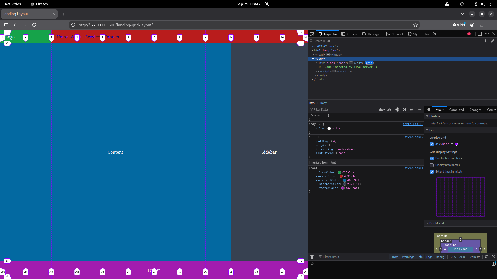

# 12-Column Landing Page Grid Layout 🌐

A classic multi-section web landing layout built with pure **HTML & CSS Grid** as part of the **Zero to CSS** learning journey.

<p align="center">
  
</p>

---

## Project Overview

This practice exercise focuses on building a foundational desktop web page layout using a **12-column fractional grid system (`repeat(12, 1fr)`)**. 

The goal was to master column track spanning, grid line indexing (including negative line indexing `-1`), and combining CSS Grid with Flexbox for internal component alignment.

### Key Concepts Practiced:
- **12-Column Grid System**: Using `grid-template-columns: repeat(12, 1fr)` to create standard web column tracks.
- **Explicit Track Spanning**:
  - `grid-column: 1 / 3` (2 columns for Logo).
  - `grid-column: 3 / -1` (10 columns spanning to the end for Navigation).
  - `grid-column: 1 / 10` (9 columns for Main Content).
  - `grid-column: 10 / -1` (3 columns spanning to the end for Sidebar).
  - `grid-column: 1 / -1` (Full 12 columns spanning across the page for Footer).
- **Row Heights**: Fixed header (50px), flexible main content (`1fr`), and fixed footer (70px) via `grid-template-rows: 50px 1fr 70px`.
- **Semantic HTML5**: Using appropriate structural tags (`<section>`, `<aside>`, `<footer>`, `<nav>`).
- **CSS Variables (`:root`)**: Organized palette for individual sections.
- **Flexbox inside Grid Cells**: Utilizing Flexbox inside individual grid items to center titles and distribute navigation links.

---

## Grid Layout Architecture

The page layout is structured across 12 equal fraction columns (`1fr` each):

```text
+-------------------------------------------------------------------------+
| Line 1            Line 3                                       Line 13  |
| [  Logo (2 cols)  ] [                 Nav (10 cols)                   ] |
|-------------------------------------------------------------------------|
| Line 1                                 Line 10                 Line 13  |
| [        Main Content (9 cols)        ] [      Sidebar (3 cols)       ] |
|-------------------------------------------------------------------------|
| Line 1                                                         Line 13  |
| [                         Footer (12 cols)                            ] |
+-------------------------------------------------------------------------+
```

### Grid Mapping Table

| Section | Tag | Grid Column | Total Columns | Role |
| :--- | :--- | :--- | :---: | :--- |
| **Logo** | `<div class="logo">` | `1 / 3` | 2 | Brand identifier |
| **Nav** | `<div class="nav">` | `3 / -1` | 10 | Primary navigation links |
| **Content** | `<section class="content">` | `1 / 10` | 9 | Primary article/body area |
| **Sidebar** | `<aside class="sidebar">` | `10 / -1` | 3 | Complementary sidebar panel |
| **Footer** | `<footer class="footer">` | `1 / -1` | 12 | Bottom copyright / links bar |

---

## Project Structure

```text
landing-grid-layout/
├── index.html        # Semantic structure of the landing page
├── style.css         # 12-column grid definition, reset & section styling
├── screenshot.png    # Layout preview with DevTools grid overlay
└── README.md         # Documentation and grid specifications
```

---

## Key Learnings & Takeaways

1. **Negative Line Indexing (`-1`)**:
   - In CSS Grid, `-1` references the very last line of the grid track. Writing `grid-column: 3 / -1` or `1 / -1` guarantees spanning to the edge without manually counting column numbers.
2. **Column Gaps & Alignment**:
   - Column coordinate boundaries must match up precisely (e.g. `1 / 10` followed immediately by `10 / -1`) to avoid accidental unstyled column gaps.
3. **CSS Grid + Flexbox Synergy**:
   - CSS Grid handles the macro 2D layout (positioning large page sections).
   - Flexbox handles the micro 1D alignment inside each section (e.g. centering text in `.content` or spacing out links in `.nav ul`).

---

## Scope Note

> [!NOTE]
> This project was developed as a focused exercise in **desktop 12-column grid track math and line placement**. Responsive multi-device adaptation (media queries, single-column mobile stacking) is reserved for future exercises.
