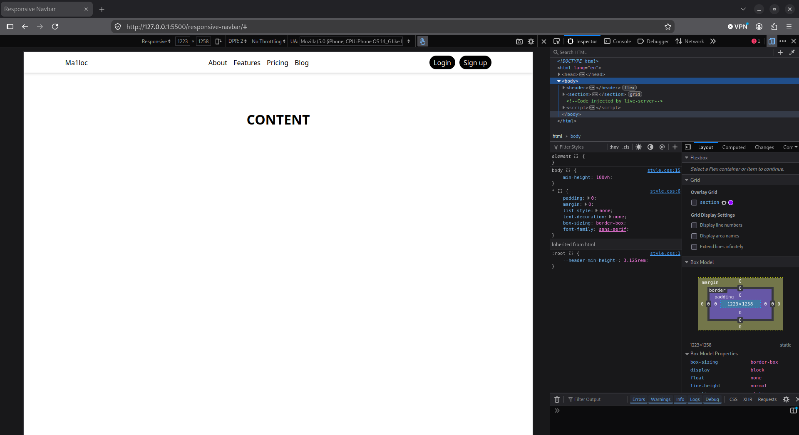
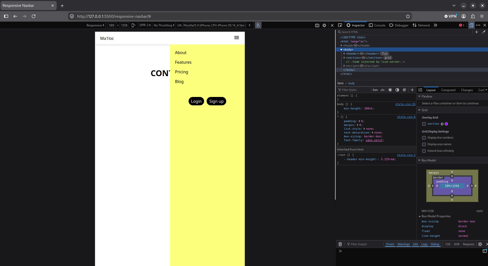

# Responsive Navbar with Mobile Drawer

A clean, modern, and fully responsive navigation bar featuring a full-width drop shadow on desktop and a smooth slide-out drawer menu on mobile, built with **pure HTML & CSS**.

Part of the **Zero to CSS** learning journey (Day 3).

---

## Showcase

### Desktop View (> 640px)
Full-width edge-to-edge shadow, centered 1024px content with horizontal navigation links and pill action buttons.

<p align="center">
  
</p>

---

### Mobile View (≤ 640px)
Top bar with Logo and hamburger icon, revealing a fixed right-side drawer menu with stacked navigation links and action buttons.

<p align="center">
  
</p>

---

## Key Features & Architecture

1. **Outer Shell + Inner Core Pattern**:
   * `<header>` spans **100% full width** to hold the continuous edge-to-edge `box-shadow`.
   * `.nav-container` constrains the content to `max-width: 1024px; margin: 0 auto;` with `padding: 0 20px;` for responsive side gutters.

2. **Mobile Drawer (`position: fixed`)**:
   * Pinned right below the navbar using `top: var(--header-min-height-);` and stretched to the bottom edge with `bottom: 0; right: 0;` (0 overflow, no scrollbars).
   * Fluid responsive width using CSS `clamp()`:
     ```css
     width: clamp(6.25rem, 50vw, 18.75rem);
     ```

3. **Modern Media Queries**:
   * Uses modern range syntax `@media (width <= 640px)` to cleanly toggle between desktop and mobile navigation.

4. **CSS Custom Properties**:
   * Defines `--header-min-height-: 3.125rem` (50px) in `:root` to keep navbar height and drawer offset synchronized.

---

## Project Structure

```text
responsive-navbar/
├── desktop.png       # Desktop layout preview
├── mobile.png        # Mobile drawer layout preview
├── index.html        # Semantic markup (desktop & mobile nav separation)
├── style.css         # Flexbox, positioning, and responsive media queries
├── Public/           # Visual assets
│   └── menu-icon.svg # Hamburger menu SVG icon
└── README.md         # Project documentation
```

---

## Key Learnings & Takeaways

* **CSS Specificity on Links (`<a>`)**: Hyperlinks do not inherit parent text colors by default due to user-agent styles; setting `a { color: black; }` (or `color: inherit;`) gives you full control.
* **Full-Width Header Pattern**: Separating the 100% width `<header>` from the 1024px centered `.nav-container` allows background colors and shadows to stretch across the entire screen on wide displays.
* **Eliminating Scrollbars**: Using `bottom: 0` instead of `height: 100%` on absolutely/fixed positioned elements with a `top` offset prevents 50px overflow scrollbars.
